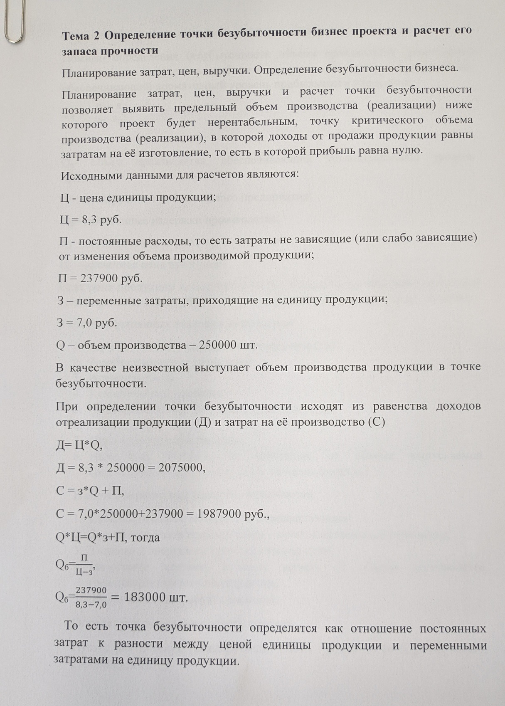
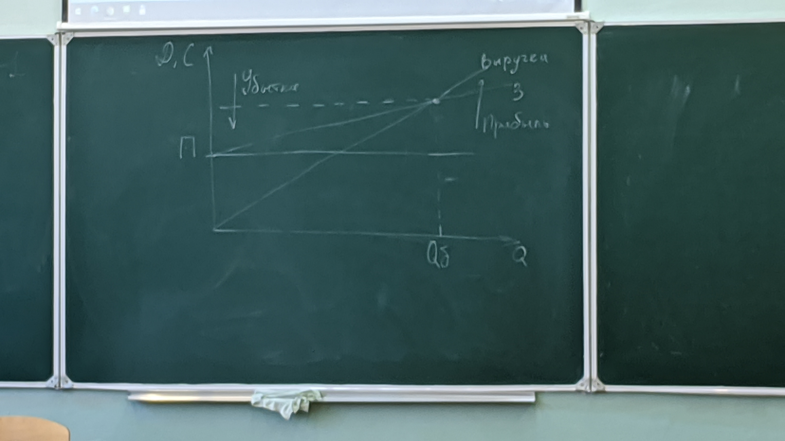

[На главную](./README.md)

# О организации рабочих мест

- Рабочая температура 22-24 радуса
- Влажность воздуха 40-60%
- Стол лучше наколнённый на себя
- Статики 20 минут, после этого перерыв на походить. После 40 минут 10 минут на походить.
Человек должен лежать или ходить.

Нельзя тянуться за предметами, это проблема.
Свободная и удобна обувь, вентилируемая

Определенение избыточноти:  
Исходные данные:
- С = 8.3 руб
  > Цена единицы продукции 
- P = 237900 руб
  > Постоянные расходы, слабозависящие от изменения объёма производимой продукции.
- З = 7.0 руб
  > Переменные затраты приходящиеся на еденицу продукции.
- Q = 250000 штук
  > Объём производства
-----
Найти Объём производства продукции в точке `не избыточности`
```
Выручка от реализации:
Д = З * Q + P = 7.0 * 250000 + 237900 = 1987900;
Qб = P / Ц-З = 183000.
Точка безубыточности - Qб
```
Пусть фактический и планируемый объём производства составляет Qf = 250000 единиц.  
Индекс безопасности проекта:  
```   
Kq = Qf / Qб = 1.268 
```   
При неизменных цене и затратах объём производства уменьшается на более чем 26.8% проект становится убыточным.  
## Фото задачки
<details>
<summary>Спойлер</summary>

  
</details>
 
 ---

Цена продукта при которой проект является безубыточным.  
```   
C = (З * Qf + P) / Qf = 7.952;
```
при которых фактический (планируемый) будет соответстовать точке безубыточности
Постоянные затраты при которых фактический (планируемый) будет соответстовать точке безубыточности.  
```
Pф = Qf(C-З)
```
Переменные затраты на еденицу продукции при которых фактический (планируемый) будет соответстовать точке безубыточности.
```
Зф = (Qf*C-P) / Qf  = 7.348
``` 

Если при неизменном производстве или затратах цена продукта изменится более чем на 4.2% проект станет убыточным.
```
Кр = (Pф - P) / P;
```

При увеличении постоянных затрат более чем на 36.6% или переменных затрат на единицу продукции более чем на 4.98% проект станет убыточным.

Точка безубыточности служит важным показателем при оценке риска инвестиции. Чем ниже точка безубыточности тем менее чувствителен проект к изменению объёма производства. Цены единицы продукции, затрат на производство, тем ниже риск несостоятельности проекта. Анализ безубыточности позволяет выявить наиболее чувствительные показатели.

Можно определить построив график.
```
 ^ C, D
 |
 |                 /
 |               /
 |             / 
 |___________/_____________________________
 |         / 
 |       /
 |     /
 |   / 
 |_______________________________________> Q
```
<details>
<summary>Рисунок от Павла</summary>

  
</details>

Есть доп расходы
- Представительские расходы (поездки, командировки)
- Налоговые платежи от объёма отпускаемой и реализуемой продукции
- Налог на недвижимость
- И др.

В состав переменных издержек
- Стоимость сырья, материалов комплектующих.
- заработная плата промышленно производственному персоналу. Рабочим сдельщикам.
- Налоговые платежи от объёма производства (реализации) предприятия.
- НДС